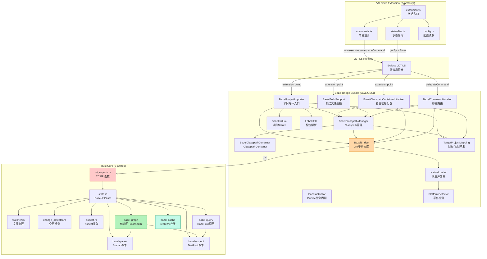
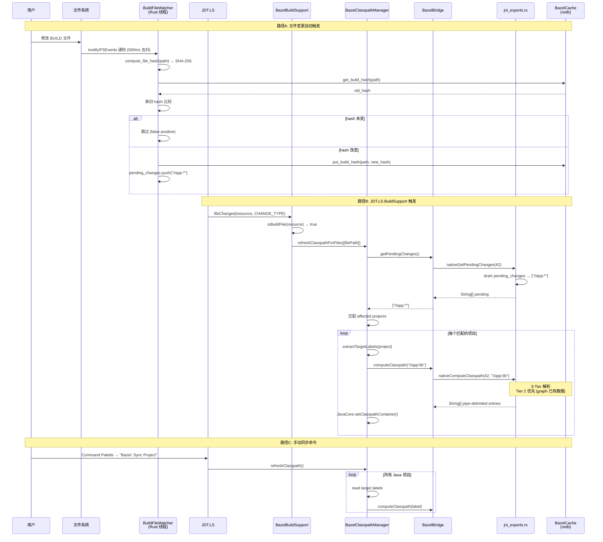
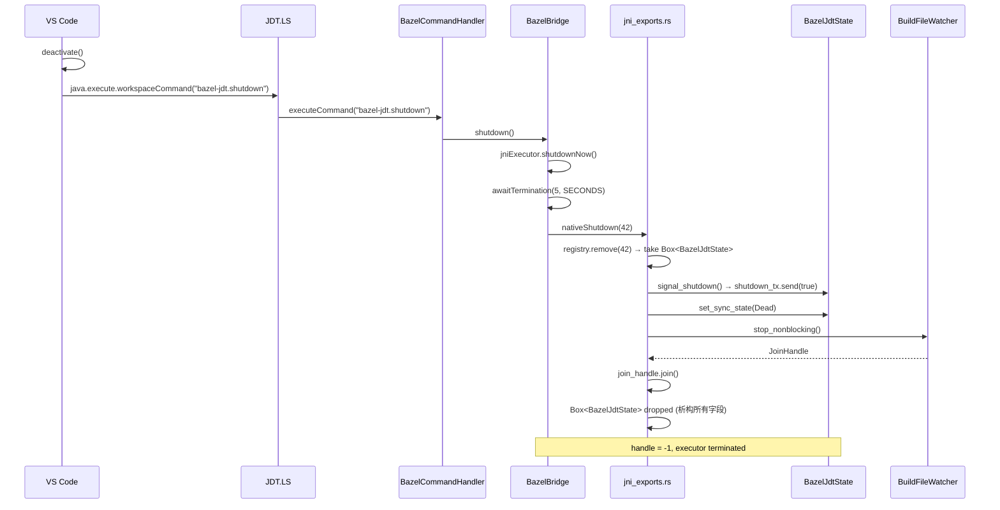
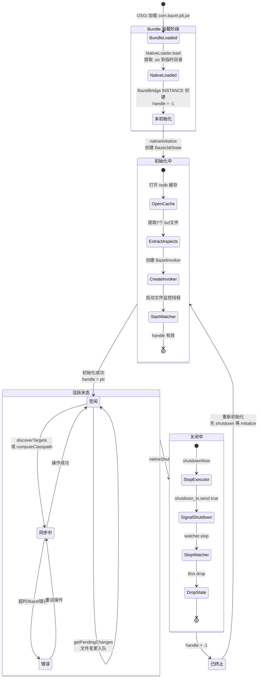
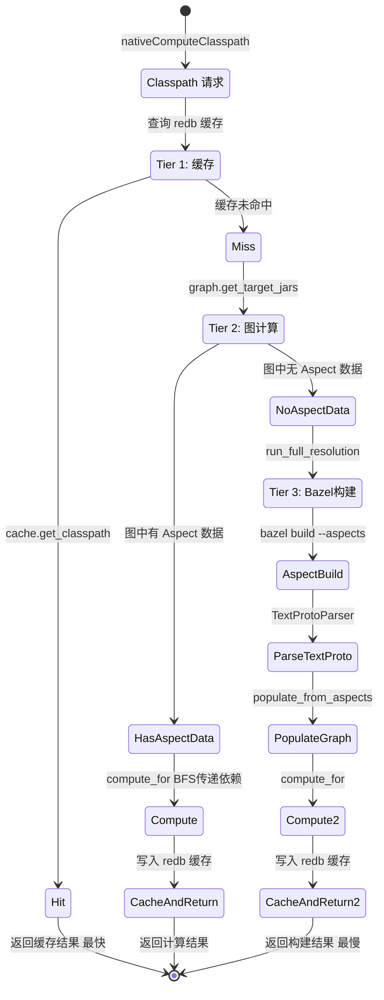
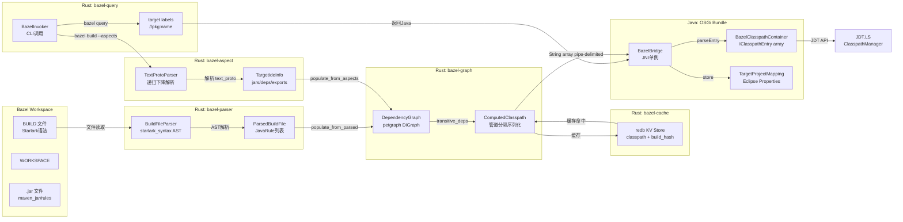
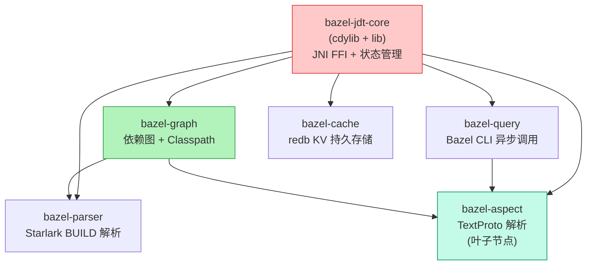
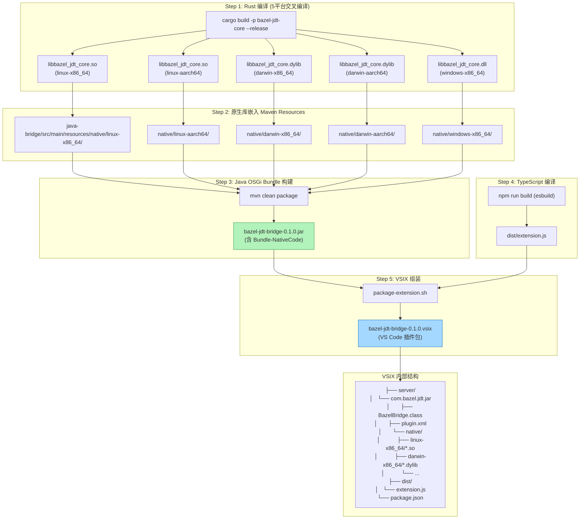

# Bazel JDT Bridge — 项目导入完整生命周期分析

> 分析版本：2026-05-01 | 分支：001-bazel-java-resolver

---

## 1. 系统架构总览

### 1.1 四层架构

```
┌─────────────────────────────────────────────────────────┐
│                   VS Code Extension                      │
│              (TypeScript / esbuild)                      │
│   extension.ts · commands.ts · statusBar.ts · config.ts │
├─────────────────────────────────────────────────────────┤
│                  Eclipse JDT.LS                          │
│              (Java / OSGi Runtime)                       │
│  提供: ProjectImporter · BuildSupport · Classpath API    │
├─────────────────────────────────────────────────────────┤
│               Bazel JDT Bridge (Java)                    │
│            (OSGi Bundle / Maven / Java 17)               │
│  13个类: Bridge · Importer · ClasspathManager · ...      │
│  plugin.xml 注册 5 个扩展点                              │
├─────────────────────────────────────────────────────────┤
│               Bazel JDT Core (Rust)                      │
│          (cdylib / JNI / Cargo Workspace)                │
│  6个crate: parser · aspect · query · graph · cache · core│
│  7个FFI函数 · redb持久缓存 · notify文件监控              │
└─────────────────────────────────────────────────────────┘
         │                    │                    │
    VS Code API        JDT.LS Extension      JNI FFI
    workspaceCommand   Points (plugin.xml)   (long handle)
```

### 1.2 组件依赖关系



---

## 2. 完整生命周期时序图

### 2.1 项目导入主流程

```mermaid
sequenceDiagram
    participant User as 用户
    participant VSCode as VS Code
    participant RHJava as Red Hat Java<br/>(JDT.LS Host)
    participant JDTLS as JDT.LS
    participant OSGi as OSGi Runtime
    participant Activator as BazelActivator
    participant Importer as BazelProjectImporter
    participant Bridge as BazelBridge
    participant NativeLoader as NativeLoader
    participant JNI as jni_exports.rs
    participant State as BazelJdtState
    participant Bazel as Bazel CLI

    User->>VSCode: 打开含 WORKSPACE 的目录
    VSCode->>RHJava: activationEvent: workspaceContains:WORKSPACE
    RHJava->>JDTLS: 启动语言服务器
    RHJava->>OSGi: 加载 javaExtensions: com.bazel.jdt.jar

    rect rgb(230, 240, 255)
        Note over OSGi,Activator: Phase 0: Bundle 激活
        OSGi->>Activator: start(bundleContext)
        Activator->>Activator: 注册 IResourceChangeListener<br/>(清理幽灵项目)
    end

    rect rgb(230, 255, 230)
        Note over JDTLS,NativeLoader: Phase 0.5: 原生库加载 (static initializer)
        JDTLS->>Importer: applies(monitor)
        Importer->>Importer: 检查 WORKSPACE/WORKSPACE.bazel 存在
        Importer-->>JDTLS: true (claim workspace)
    end

    rect rgb(255, 245, 230)
        Note over JDTLS,Importer: Phase 1: 项目导入
        JDTLS->>Importer: importToWorkspace(monitor)
        Importer->>Bridge: getInstance()
        Bridge->>NativeLoader: load()
        NativeLoader->>NativeLoader: PlatformDetector.detectPlatform()
        NativeLoader->>NativeLoader: 从JAR提取.so/.dylib/.dll到临时目录
        NativeLoader->>NativeLoader: System.load(tempPath)

        Importer->>Bridge: isInitialized()
        Bridge-->>Importer: false

        Importer->>Bridge: initialize(workspacePath, "bazel", cacheDir)
        Bridge->>Bridge: rwLock.writeLock()
        Bridge->>JNI: nativeInitialize(ws, bazel, cache) → jlong handle
        JNI->>State: BazelJdtState::new()
        State->>State: BazelCache::open(cacheDir)
        State->>State: DependencyGraph::new()
        State->>State: extract_if_needed() → 提取7个.bzl aspect文件
        State->>State: BazelInvoker::new()
        State->>State: watch::channel(false) ← shutdown信号
        State->>State: BuildFileWatcher::start() ← 文件监控线程
        JNI-->>Bridge: handle = 42
        Bridge->>Bridge: this.handle = 42
        Bridge->>Bridge: rwLock.writeLock().unlock()
    end

    rect rgb(240, 230, 255)
        Note over Importer,Bazel: Phase 2: 目标发现
        Importer->>Bridge: discoverTargets()
        Bridge->>Bridge: snapshotHandle() → h=42 (readLock)
        Bridge->>JNI: nativeDiscoverTargets(42)
        JNI->>State: set_sync_state(Syncing)
        JNI->>State: invoker.discover_java_targets() [async, 120s]
        State->>Bazel: bazel query --output=label<br/>kind(java_library, //...:*) union ...

        Bazel-->>State: //app:lib\n//app:main\n//lib:utils\n...
        State->>State: populate_graph_from_build_files()
        State->>State: change_detector::collect_build_files()
        loop 每个 BUILD 文件
            State->>State: parser.parse_file() → ParsedBuildFile
            State->>State: 提取 java_library/binary/test/import 规则
        end
        State->>State: graph.populate_from_parsed_batch()

        State->>Bazel: bazel build --aspects=//.bazel-jdt/aspects:...<br/>--output_groups=intellij-info-java ...
        Bazel-->>State: .intellij-info.txt 文件路径列表
        loop 每个 .intellij-info.txt
            State->>State: TextProtoParser::parse_target_ide_info()
            State->>State: 提取: label, kind, jars, deps, exports
        end
        State->>State: graph.populate_from_aspects()
        State->>State: set_sync_state(Idle)
        JNI-->>Bridge: String[] {"//app:lib", "//app:main", "//lib:utils"}
    end

    rect rgb(255, 230, 230)
        Note over Importer,State: Phase 3: 项目创建 + Classpath 设置
        loop 每个 targetLabel
            Importer->>Importer: extractPackageName(label)<br/>//app:lib → "app"
            Importer->>Importer: workspaceRoot.getProject("app")
            alt 项目不存在
                Importer->>Importer: project.create() + project.open()
            end
            Importer->>Importer: 设置 natures: javanature + bazelNature
            Importer->>Importer: TargetProjectMapping.appendTargets()
            Importer->>Importer: 配置 source entries

            Importer->>Bridge: computeClasspath("//app:lib")
            Bridge->>JNI: nativeComputeClasspath(42, "//app:lib")

            alt Tier 1: 缓存命中
                JNI->>State: cache.get_classpath("//app:lib")
                State-->>JNI: ComputedClasspath JSON
            else Tier 2: 图计算
                JNI->>State: graph.transitive_deps("//app:lib") [BFS]
                JNI->>State: ComputedClasspath::compute_for()
            else Tier 3: 完整Aspect构建
                JNI->>Bazel: bazel build --aspects=... //app:lib
                Bazel-->>JNI: .intellij-info.txt
                JNI->>State: graph.populate_from_aspects()
                JNI->>State: ComputedClasspath::compute_for()
            end

            JNI-->>Bridge: String[] {"LIB|/path/a.jar|...|false|false|", ...}
            Bridge-->>Importer: String[] entries

            Importer->>Importer: new BazelClasspathContainer(entries)
            Importer->>Importer: TargetProjectMapping.storeCachedClasspath()
            Importer->>Importer: JavaCore.setClasspathContainer()
            Importer->>Importer: javaProject.setRawClasspath()
        end
    end

    rect rgb(230, 255, 255)
        Note over VSCode,Bridge: Phase 4: VS Code 扩展激活
        VSCode->>VSCode: activate(context)
        VSCode->>VSCode: createStatusBar() ← 状态轮询
        VSCode->>VSCode: registerCommands() ← 3个命令

        loop 每 2-10 秒轮询
            VSCode->>Bridge: getSyncState()
            Bridge->>JNI: nativeGetSyncState(42)
            JNI-->>Bridge: 0 (Idle)
            Bridge-->>VSCode: 0
            VSCode->>VSCode: 状态栏: "Bazel ✓" (绿色)
        end
    end
```



### 2.2 增量同步流程



### 2.3 关闭流程



---

## 3. 状态机

### 3.1 系统状态转换



### 3.2 Classpath 3-Tier 解析策略



---

## 4. 数据流

### 4.1 管道分隔格式 (Rust → Java)

```
格式: TYPE|path|sourceAttachmentPath|isTest|isExported|accessRules

TYPE:
  LIB  → JavaCore.newLibraryEntry()     外部JAR
  PROJ → JavaCore.newProjectEntry()     工作区内部目标
  SRC  → JavaCore.newSourceEntry()      源码目录

示例:
  LIB|/home/user/.cache/bazel/.../guava.jar||false|false|+com.google.**:-internal.**
  PROJ|//app:lib||false|false|
  SRC|/workspace/app/src/main/java||false|false|
```

### 4.2 TextProto 格式 (Bazel Aspect → Rust)

```
Bazel Aspect 输出 .intellij-info.txt (TextProto格式):

label: "//app:lib"
kind: "java_library_"
java_info {
  jars { jar { relative_path: "app/lib.jar" } }
  jars { jar { relative_path: "app/lib-src.jar" } source_jar { relative_path: "app/lib-sources.jar" } }
  javac_options { option: "--release" option: "17" }
  generated_class_jar { relative_path: "app/gen.jar" }
}
deps { label: "//lib:utils" }
runtime_deps { label: "//runtime:driver" }
exports { label: "//api:public" }
```

### 4.3 持久化存储

```
Eclipse Persistent Properties (per IProject):
  com.bazel.jdt / targetLabels     → "//app:lib,//app:main"
  com.bazel.jdt / workspacePath    → "/home/user/workspace"
  com.bazel.jdt / bazelPath        → "bazel"
  com.bazel.jdt / cacheDir         → "/home/user/.cache/bazel-jdt"
  com.bazel.jdt / classpath.<label> → pipe-delimited entries JSON

redb Tables (per workspace):
  classpath  → target_label → ComputedClasspath JSON
  build_hash → build_file_path → SHA-256 hex
```

### 4.4 完整数据流图



---

## 5. 关键类与方法详解

### 5.1 Java 层核心类

| 类 | 职责 | 关键方法 | 扩展点 |
|----|------|---------|--------|
| `BazelBridge` | JNI单例桥接，管理handle和executor | `initialize()`, `discoverTargets()`, `computeClasspath()`, `shutdown()` | — |
| `BazelProjectImporter` | 项目导入入口，创建Eclipse项目 | `applies()`, `importToWorkspace()`, `configureClasspath()` | `org.eclipse.jdt.ls.core.importers` |
| `BazelClasspathManager` | 静态工具，设置/刷新Classpath容器 | `setClasspathContainer()`, `refreshClasspath()`, `refreshClasspathForFiles()` | — |
| `BazelClasspathContainer` | JDT容器实现，解析管道格式 | `getClasspathEntries()`, `getDescription()`, `parseEntry()` | — |
| `BazelClasspathContainerInitializer` | JDT容器延迟初始化 | `initialize()`, `doInitialize()`, `recoverFromCache()` | `org.eclipse.jdt.core.classpathContainerInitializer` |
| `BazelBuildSupport` | BUILD文件变更检测 | `fileChanged()`, `isBuildFile()` | `org.eclipse.jdt.ls.core.buildSupport` |
| `BazelCommandHandler` | VS Code命令路由 | `executeCommand()`, 5个handle方法 | `org.eclipse.jdt.ls.core.delegateCommandHandler` |
| `BazelActivator` | OSGi Bundle生命周期 | `start()`, `stop()` | `Bundle-Activator` |
| `NativeLoader` | 原生库提取加载 | `load()` | — |
| `PlatformDetector` | OS/架构检测 | `detectPlatform()` | — |
| `BazelNature` | 项目Nature标记 | `setNatures()`, `configure()` | `org.eclipse.core.resources.natures` |
| `TargetProjectMapping` | 持久化属性存储 | `appendTargets()`, `readTargets()`, `storeCachedClasspath()` | — |
| `LabelUtils` | 标签解析工具 | `extractPackageName()` | — |

### 5.2 Rust FFI 函数表

| # | FFI 函数 | Java 签名 | 功能 | 超时 |
|---|---------|-----------|------|------|
| 1 | `nativeInitialize` | `long nativeInitialize(String ws, String bazel, String cache)` | 创建全局状态，提取aspects，启动文件监控 | — |
| 2 | `nativeShutdown` | `void nativeShutdown(long handle)` | 信号关闭，停止监控，释放状态 | 5s |
| 3 | `nativeDiscoverTargets` | `String[] nativeDiscoverTargets(long handle)` | bazel query + BUILD解析 + 批量aspect构建 | 330s |
| 4 | `nativeComputeClasspath` | `String[] nativeComputeClasspath(long handle, String target)` | 3-Tier解析：缓存→图→aspect构建 | 330s |
| 5 | `nativeGetSyncState` | `int nativeGetSyncState(long handle)` | 返回同步状态枚举值 | — |
| 6 | `nativeCleanCache` | `void nativeCleanCache(long handle)` | 清空redb所有表 | — |
| 7 | `nativeGetPendingChanges` | `String[] nativeGetPendingChanges(long handle)` | 排空文件变更队列 | — |

### 5.3 Rust Crate 依赖图



---

## 6. 构建打包流水线



---

## 7. 设计分析

### 7.1 架构亮点

| 设计决策 | 分析 |
|---------|------|
| **Handle-based State** | Java 持有 `jlong` 键，Rust 持有 `Box<BazelJdtState>` 在全局 HashMap。解耦了两层内存管理，但无 generation/lifetime 校验 — shutdown 后调用是 UB。 |
| **3-Tier Classpath 解析** | 缓存 → 图计算 → Bazel构建。大多数请求命中 Tier 2（图已有 Aspect 数据），只有新目标或缓存失效才走 Tier 3。分层设计有效减少 Bazel 调用。 |
| **Single-Thread JNI Executor** | 所有 JNI 调用序列化到单线程 `jniExecutor`，避免并发 JNI 调用。`ReentrantReadWriteLock` 保护 handle 读写。 |
| **Bundled Aspects** | 7个 `.bzl` 文件通过 `include_str!()` 嵌入 Rust 二进制，首次运行提取到 `.bazel-jdt/aspects/`，版本用 SHA-256 跟踪。自包含，无需额外安装。 |
| **双路径触发** | 自动触发（JDT.LS importer）+ 手动触发（VS Code 命令）。幂等守卫防止双重初始化。 |
| **持久化恢复** | `BazelClasspathContainerInitializer.recoverFromCache()` 从 Eclipse persistent properties 恢复 classpath，无需重跑 Bazel。IDE 重启快速恢复。 |

### 7.2 已知风险与反模式

| 风险 | 严重性 | 位置 | 说明 |
|------|--------|------|------|
| **JNI Use-After-Free** | 高 | `BazelBridge.snapshotHandle()` | shutdown 后 handle=-1，但并发 executor 中的任务可能仍在使用旧 handle。无 generation counter 或 guard。 |
| **空 catch 块** | 中 | `BazelClasspathManager` (3处), `BazelProjectImporter` (1处) | 异常被静默吞掉，可能掩盖关键错误。 |
| **filter_by_visibility 空实现** | 中 | `classpath.rs::filter_by_visibility()` | 函数体为空，所有目标都通过可见性过滤。Bazel visibility 规则未生效。 |
| **NativeLoader 手动提取** | 低 | `NativeLoader.java` | `Bundle-NativeCode` 声明在 bnd.bnd 但实际不用 OSGi 原生加载机制。声明与实现不一致。 |
| **幂等守卫不对等** | 低 | `BazelProjectImporter` vs `BazelCommandHandler` | importer 有 `isInitialized()` 守卫跳过重复导入；command handler 的 `handleImportProject` 没有，可以强制重新初始化。设计意图但可能混淆。 |
| **syncOnSave 死代码** | 低 | `config.ts` | 配置项声明但未使用。BUILD 文件监控完全由 Java 层 `BazelBuildSupport` 处理。 |
| **打包验证宽松** | 低 | `package-extension.sh` | 原生库缺失只 WARNING 不 ERROR (`|| true`)，可能产出不含原生库的 VSIX。 |

### 7.3 线程模型

```
┌──────────────────────────────────────────────────┐
│ VS Code Main Thread                              │
│   extension.ts activate/deactivate               │
│   statusBar poll loop (setInterval)              │
│   command handlers → java.execute.workspaceCommand│
└──────────────────────────────────────────────────┘

┌──────────────────────────────────────────────────┐
│ JDT.LS Thread Pool                               │
│   BazelProjectImporter.importToWorkspace()        │
│   BazelBuildSupport.fileChanged()                 │
│   BazelCommandHandler.executeCommand()             │
│   BazelClasspathContainerInitializer.initialize() │
└──────────────────────────────────────────────────┘

┌──────────────────────────────────────────────────┐
│ bazel-jdt-native Thread (Java single-thread)     │
│   所有 JNI 调用序列化执行                          │
│   nativeInitialize / nativeDiscoverTargets / ...  │
│   ReentrantReadWriteLock 保护 handle              │
└──────────────────────────────────────────────────┘

┌──────────────────────────────────────────────────┐
│ bazel-jdt-build-watcher Thread (Rust OS thread)  │
│   notify debouncer (500ms)                        │
│   SHA-256 hash 比较                               │
│   pending_changes 队列                            │
└──────────────────────────────────────────────────┘

┌──────────────────────────────────────────────────┐
│ Tokio Runtime (Rust async)                       │
│   BazelInvoker: bazel query/build 子进程          │
│   shutdown watch channel 监听                     │
└──────────────────────────────────────────────────┘
```

---

## 8. 命令路由表

| VS Code 命令 | TS Handler | Java Handler | JNI 调用 | 功能 |
|-------------|-----------|-------------|---------|------|
| `bazel-jdt.importProject` | 进度窗口 "Discovering Java targets..." | `handleImportProject()` → initialize + discoverTargets + refreshClasspath | nativeInitialize + nativeDiscoverTargets + N×nativeComputeClasspath | 完整重新导入 |
| `bazel-jdt.syncProject` | 无UI | `handleSyncProject()` → refreshClasspath | N×nativeComputeClasspath | 增量同步 |
| `bazel-jdt.cleanCache` | 确认对话框 | `handleCleanCache()` | nativeCleanCache | 清空redb缓存 |
| `bazel-jdt.getSyncState` | 状态栏自动调用 | 直接调用 | nativeGetSyncState | 查询状态 |
| `bazel-jdt.shutdown` | deactivate() 自动调用 | `handleShutdown()` | nativeShutdown | 关闭清理 |

---

## 9. plugin.xml 扩展点注册

```xml
<!-- 项目导入器 (order=200, 优先级较低) -->
<extension point="org.eclipse.jdt.ls.core.importers">
    <importer class="com.bazel.jdt.BazelProjectImporter" order="200"/>
</extension>

<!-- 构建支持 (BUILD文件变更检测) -->
<extension point="org.eclipse.jdt.ls.core.buildSupport">
    <buildSupport class="com.bazel.jdt.BazelBuildSupport" order="200"/>
</extension>

<!-- Classpath容器初始化器 -->
<extension point="org.eclipse.jdt.core.classpathContainerInitializer">
    <classpathContainerInitializer
        id="com.bazel.jdt.BAZEL_CONTAINER"
        class="com.bazel.jdt.BazelClasspathContainerInitializer"/>
</extension>

<!-- VS Code 命令处理器 -->
<extension point="org.eclipse.jdt.ls.core.delegateCommandHandler">
    <delegateCommandHandler id="bazel-jdt">
        <command id="bazel-jdt.importProject"/>
        <command id="bazel-jdt.syncProject"/>
        <command id="bazel-jdt.cleanCache"/>
        <command id="bazel-jdt.getSyncState"/>
        <command id="bazel-jdt.shutdown"/>
    </delegateCommandHandler>
</extension>

<!-- 项目 Nature -->
<extension point="org.eclipse.core.resources.natures">
    <runtime>
        <run class="com.bazel.jdt.BazelNature"/>
    </runtime>
</extension>
```
