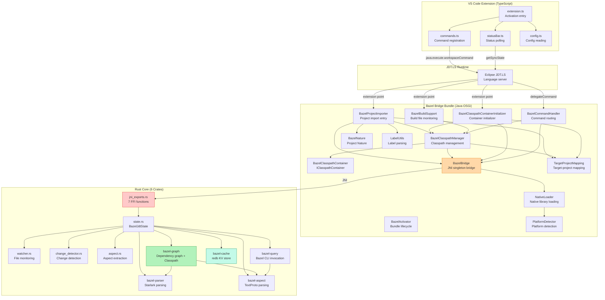
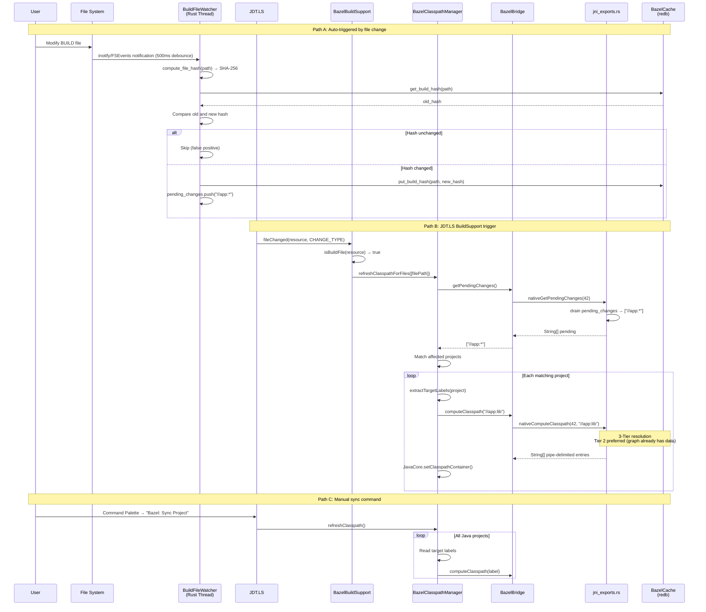
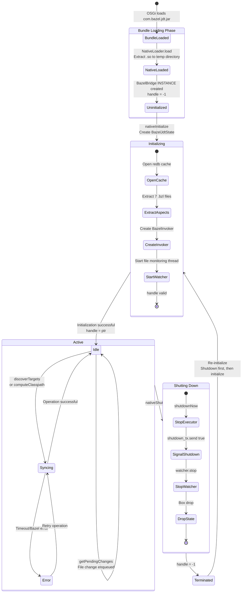
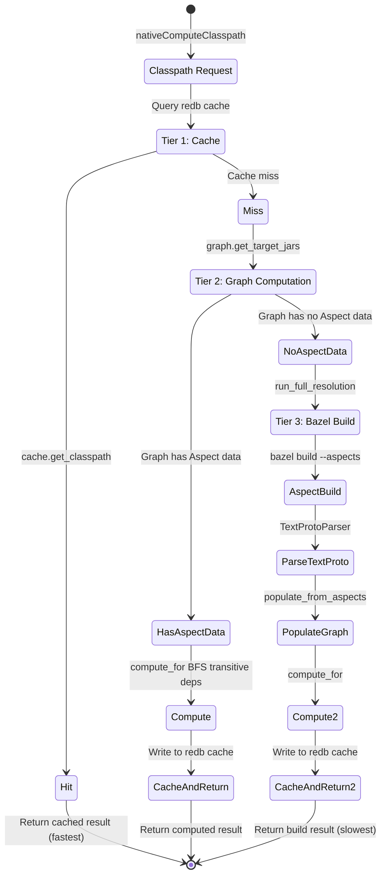
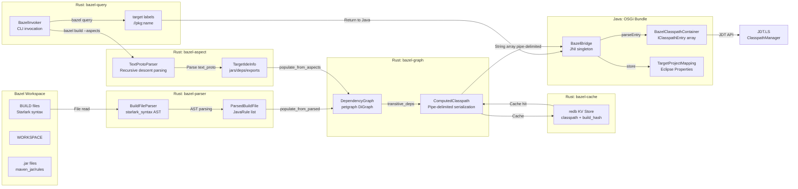
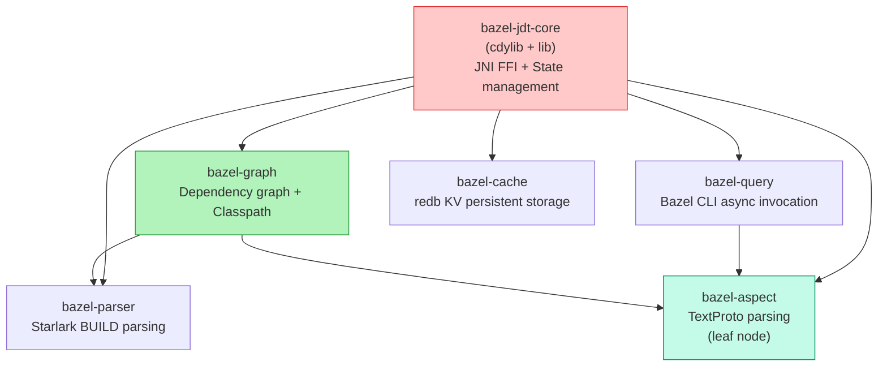
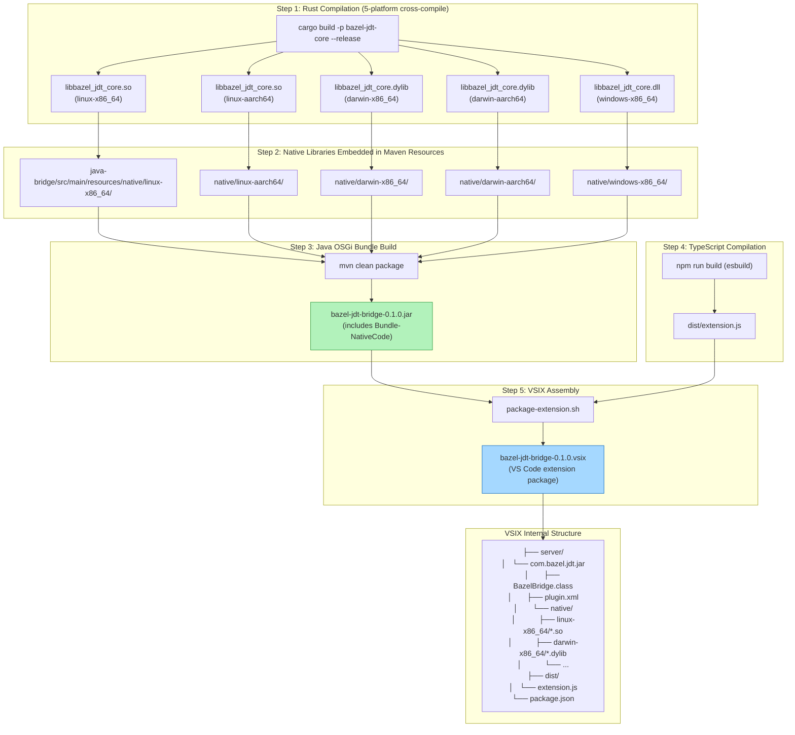

# Bazel JDT Bridge — Complete Project Import Lifecycle Analysis

> Analysis version: 2026-05-01 | Branch: 001-bazel-java-resolver

---

## 1. System Architecture Overview

### 1.1 Four-Layer Architecture

```
┌─────────────────────────────────────────────────────────┐
│                   VS Code Extension                      │
│              (TypeScript / esbuild)                      │
│   extension.ts · commands.ts · statusBar.ts · config.ts │
├─────────────────────────────────────────────────────────┤
│                  Eclipse JDT.LS                          │
│              (Java / OSGi Runtime)                       │
│  Provides: ProjectImporter · BuildSupport · Classpath API│
├─────────────────────────────────────────────────────────┤
│               Bazel JDT Bridge (Java)                    │
│            (OSGi Bundle / Maven / Java 17)               │
│  13 classes: Bridge · Importer · ClasspathManager · ...  │
│  plugin.xml registers 5 extension points                 │
├─────────────────────────────────────────────────────────┤
│               Bazel JDT Core (Rust)                      │
│          (cdylib / JNI / Cargo Workspace)                │
│  6 crates: parser · aspect · query · graph · cache · core│
│  7 FFI functions · redb persistent cache · notify file watching│
└─────────────────────────────────────────────────────────┘
         │                    │                    │
    VS Code API        JDT.LS Extension      JNI FFI
    workspaceCommand   Points (plugin.xml)   (long handle)
```

### 1.2 Component Dependencies



---

## 2. Complete Lifecycle Sequence Diagrams

### 2.1 Project Import Main Flow

```mermaid
sequenceDiagram
    participant User as User
    participant VSCode as VS Code
    participant RHJava as Red Hat Java<br/>(JDT.LS Host)
    participant JDTLS as JDT.LS
    participant OSGi as OSGi Runtime
    participant Activator as BazelActivator
    participant Importer as BazelProjectImporter
    participant Bridge as BazelBridge
    participant NativeLoader as NativeLoader
    participant JNI as jni_exports.rs
    participant State as BazelJdtState
    participant Bazel as Bazel CLI

    User->>VSCode: Open directory containing WORKSPACE
    VSCode->>RHJava: activationEvent: workspaceContains:WORKSPACE
    RHJava->>JDTLS: Start language server
    RHJava->>OSGi: Load javaExtensions: com.bazel.jdt.jar

    rect rgb(230, 240, 255)
        Note over OSGi,Activator: Phase 0: Bundle Activation
        OSGi->>Activator: start(bundleContext)
        Activator->>Activator: Register IResourceChangeListener<br/>(cleanup ghost projects)
    end

    rect rgb(230, 255, 230)
        Note over JDTLS,NativeLoader: Phase 0.5: Native Library Loading (static initializer)
        JDTLS->>Importer: applies(monitor)
        Importer->>Importer: Check WORKSPACE/WORKSPACE.bazel exists
        Importer-->>JDTLS: true (claim workspace)
    end

    rect rgb(255, 245, 230)
        Note over JDTLS,Importer: Phase 1: Project Import
        JDTLS->>Importer: importToWorkspace(monitor)
        Importer->>Bridge: getInstance()
        Bridge->>NativeLoader: load()
        NativeLoader->>NativeLoader: PlatformDetector.detectPlatform()
        NativeLoader->>NativeLoader: Extract .so/.dylib/.dll from JAR to temp directory
        NativeLoader->>NativeLoader: System.load(tempPath)

        Importer->>Bridge: isInitialized()
        Bridge-->>Importer: false

        Importer->>Bridge: initialize(workspacePath, "bazel", cacheDir)
        Bridge->>Bridge: rwLock.writeLock()
        Bridge->>JNI: nativeInitialize(ws, bazel, cache) → jlong handle
        JNI->>State: BazelJdtState::new()
        State->>State: BazelCache::open(cacheDir)
        State->>State: DependencyGraph::new()
        State->>State: extract_if_needed() → Extract 7 .bzl aspect files
        State->>State: BazelInvoker::new()
        State->>State: watch::channel(false) ← shutdown signal
        State->>State: BuildFileWatcher::start() ← file monitoring thread
        JNI-->>Bridge: handle = 42
        Bridge->>Bridge: this.handle = 42
        Bridge->>Bridge: rwLock.writeLock().unlock()
    end

    rect rgb(240, 230, 255)
        Note over Importer,Bazel: Phase 2: Target Discovery
        Importer->>Bridge: discoverTargets()
        Bridge->>Bridge: snapshotHandle() → h=42 (readLock)
        Bridge->>JNI: nativeDiscoverTargets(42)
        JNI->>State: set_sync_state(Syncing)
        JNI->>State: invoker.discover_java_targets() [async, 120s]
        State->>Bazel: bazel query --output=label<br/>kind(java_library, //...:*) union ...

        Bazel-->>State: //app:lib\n//app:main\n//lib:utils\n...
        State->>State: populate_graph_from_build_files()
        State->>State: change_detector::collect_build_files()
        loop Each BUILD file
            State->>State: parser.parse_file() → ParsedBuildFile
            State->>State: Extract java_library/binary/test/import rules
        end
        State->>State: graph.populate_from_parsed_batch()

        State->>Bazel: bazel build --aspects=//.bazel-jdt/aspects:...<br/>--output_groups=intellij-info-java ...
        Bazel-->>State: .intellij-info.txt file path list
        loop Each .intellij-info.txt
            State->>State: TextProtoParser::parse_target_ide_info()
            State->>State: Extract: label, kind, jars, deps, exports
        end
        State->>State: graph.populate_from_aspects()
        State->>State: set_sync_state(Idle)
        JNI-->>Bridge: String[] {"//app:lib", "//app:main", "//lib:utils"}
    end

    rect rgb(255, 230, 230)
        Note over Importer,State: Phase 3: Project Creation + Classpath Setup
        loop Each targetLabel
            Importer->>Importer: extractPackageName(label)<br/>//app:lib → "app"
            Importer->>Importer: workspaceRoot.getProject("app")
            alt Project doesn't exist
                Importer->>Importer: project.create() + project.open()
            end
            Importer->>Importer: Set natures: javanature + bazelNature
            Importer->>Importer: TargetProjectMapping.appendTargets()
            Importer->>Importer: Configure source entries

            Importer->>Bridge: computeClasspath("//app:lib")
            Bridge->>JNI: nativeComputeClasspath(42, "//app:lib")

            alt Tier 1: Cache hit
                JNI->>State: cache.get_classpath("//app:lib")
                State-->>JNI: ComputedClasspath JSON
            else Tier 2: Graph computation
                JNI->>State: graph.transitive_deps("//app:lib") [BFS]
                JNI->>State: ComputedClasspath::compute_for()
            else Tier 3: Full Aspect build
                JNI->>Bazel: bazel build --aspects=... //app:lib
                Bazel-->>JNI: .intellij-info.txt
                JNI->>State: graph.populate_from_aspects()
                JNI->>State: ComputedClasspath::compute_for()
            end

            JNI-->>Bridge: String[] {"LIB|/path/a.jar|...|false|false|", ...}
            Bridge-->>Importer: String[] entries

            Importer->>Importer: new BazelClasspathContainer(entries)
            Importer->>Importer: TargetProjectMapping.storeCachedClasspath()
            Importer->>Importer: JavaCore.setClasspathContainer()
            Importer->>Importer: javaProject.setRawClasspath()
        end
    end

    rect rgb(230, 255, 255)
        Note over VSCode,Bridge: Phase 4: VS Code Extension Activation
        VSCode->>VSCode: activate(context)
        VSCode->>VSCode: createStatusBar() ← status polling
        VSCode->>VSCode: registerCommands() ← 3 commands

        loop Every 2-10 seconds polling
            VSCode->>Bridge: getSyncState()
            Bridge->>JNI: nativeGetSyncState(42)
            JNI-->>Bridge: 0 (Idle)
            Bridge-->>VSCode: 0
            VSCode->>VSCode: Status bar: "Bazel ✓" (green)
        end
    end
```



### 2.2 Incremental Sync Flow



### 2.3 Shutdown Flow


---

## 3. State Machine

### 3.1 System State Transitions



### 3.2 Classpath 3-Tier Resolution Strategy



---

## 4. Data Flow

### 4.1 Pipe-Delimited Format (Rust → Java)

```
Format: TYPE|path|sourceAttachmentPath|isTest|isExported|accessRules

TYPE:
  LIB  → JavaCore.newLibraryEntry()     External JAR
  PROJ → JavaCore.newProjectEntry()     Internal workspace target
  SRC  → JavaCore.newSourceEntry()      Source directory

Example:
  LIB|/home/user/.cache/bazel/.../guava.jar||false|false|+com.google.**:-internal.**
  PROJ|//app:lib||false|false|
  SRC|/workspace/app/src/main/java||false|false|
```

### 4.2 TextProto Format (Bazel Aspect → Rust)

```
Bazel Aspect outputs .intellij-info.txt (TextProto format):

label: "//app:lib"
kind: "java_library_"
java_info {
  jars { jar { relative_path: "app/lib.jar" } }
  jars { jar { relative_path: "app/lib-src.jar" } source_jar { relative_path: "app/lib-sources.jar" } }
  javac_options { option: "--release" option: "17" }
  generated_class_jar { relative_path: "app/gen.jar" }
}
deps { label: "//lib:utils" }
runtime_deps { label: "//runtime:driver" }
exports { label: "//api:public" }
```

### 4.3 Persistent Storage

```
Eclipse Persistent Properties (per IProject):
  com.bazel.jdt / targetLabels     → "//app:lib,//app:main"
  com.bazel.jdt / workspacePath    → "/home/user/workspace"
  com.bazel.jdt / bazelPath        → "bazel"
  com.bazel.jdt / cacheDir         → "/home/user/.cache/bazel-jdt"
  com.bazel.jdt / classpath.<label> → pipe-delimited entries JSON

redb Tables (per workspace):
  classpath  → target_label → ComputedClasspath JSON
  build_hash → build_file_path → SHA-256 hex
```

### 4.4 Complete Data Flow Diagram



---

## 5. Key Classes and Methods

### 5.1 Java Core Classes

| Class | Responsibility | Key Methods | Extension Point |
|-------|---------------|-------------|-----------------|
| `BazelBridge` | JNI singleton bridge, manages handle and executor | `initialize()`, `discoverTargets()`, `computeClasspath()`, `shutdown()` | — |
| `BazelProjectImporter` | Project import entry point, creates Eclipse projects | `applies()`, `importToWorkspace()`, `configureClasspath()` | `org.eclipse.jdt.ls.core.importers` |
| `BazelClasspathManager` | Static utility, sets/refreshes Classpath containers | `setClasspathContainer()`, `refreshClasspath()`, `refreshClasspathForFiles()` | — |
| `BazelClasspathContainer` | JDT container implementation, parses pipe format | `getClasspathEntries()`, `getDescription()`, `parseEntry()` | — |
| `BazelClasspathContainerInitializer` | JDT container lazy initialization | `initialize()`, `doInitialize()`, `recoverFromCache()` | `org.eclipse.jdt.core.classpathContainerInitializer` |
| `BazelBuildSupport` | BUILD file change detection | `fileChanged()`, `isBuildFile()` | `org.eclipse.jdt.ls.core.buildSupport` |
| `BazelCommandHandler` | VS Code command routing | `executeCommand()`, 5 handle methods | `org.eclipse.jdt.ls.core.delegateCommandHandler` |
| `BazelActivator` | OSGi Bundle lifecycle | `start()`, `stop()` | `Bundle-Activator` |
| `NativeLoader` | Native library extraction and loading | `load()` | — |
| `PlatformDetector` | OS/architecture detection | `detectPlatform()` | — |
| `BazelNature` | Project Nature marker | `setNatures()`, `configure()` | `org.eclipse.core.resources.natures` |
| `TargetProjectMapping` | Persistent property storage | `appendTargets()`, `readTargets()`, `storeCachedClasspath()` | — |
| `LabelUtils` | Label parsing utility | `extractPackageName()` | — |

### 5.2 Rust FFI Function Table

| # | FFI Function | Java Signature | Purpose | Timeout |
|---|-------------|---------------|---------|---------|
| 1 | `nativeInitialize` | `long nativeInitialize(String ws, String bazel, String cache)` | Create global state, extract aspects, start file monitoring | — |
| 2 | `nativeShutdown` | `void nativeShutdown(long handle)` | Signal shutdown, stop monitoring, release state | 5s |
| 3 | `nativeDiscoverTargets` | `String[] nativeDiscoverTargets(long handle)` | bazel query + BUILD parsing + batch aspect build | 330s |
| 4 | `nativeComputeClasspath` | `String[] nativeComputeClasspath(long handle, String target)` | 3-Tier resolution: cache → graph → aspect build | 330s |
| 5 | `nativeGetSyncState` | `int nativeGetSyncState(long handle)` | Return sync state enum value | — |
| 6 | `nativeCleanCache` | `void nativeCleanCache(long handle)` | Clear all redb tables | — |
| 7 | `nativeGetPendingChanges` | `String[] nativeGetPendingChanges(long handle)` | Drain file change queue | — |

### 5.3 Rust Crate Dependency Graph



---

## 6. Build & Packaging Pipeline



---

## 7. Design Analysis

### 7.1 Architecture Highlights

| Design Decision | Analysis |
|---------------|----------|
| **Handle-based State** | Java holds a `jlong` key, Rust holds `Box<BazelJdtState>` in a global HashMap. Decouples two-layer memory management, but lacks generation/lifetime validation — calling after shutdown is UB. |
| **3-Tier Classpath Resolution** | Cache → graph computation → Bazel build. Most requests hit Tier 2 (graph already has Aspect data); only new targets or cache invalidation fall through to Tier 3. Layered design effectively reduces Bazel invocations. |
| **Single-Thread JNI Executor** | All JNI calls are serialized to a single-thread `jniExecutor`, avoiding concurrent JNI calls. `ReentrantReadWriteLock` protects handle read/write. |
| **Bundled Aspects** | 7 `.bzl` files are embedded in the Rust binary via `include_str!()`, extracted to `.bazel-jdt/aspects/` on first run, with versioning tracked via SHA-256. Self-contained, no additional installation needed. |
| **Dual-Path Trigger** | Auto-trigger (JDT.LS importer) + manual trigger (VS Code commands). Idempotency guard prevents double initialization. |
| **Persistent Recovery** | `BazelClasspathContainerInitializer.recoverFromCache()` restores classpath from Eclipse persistent properties without re-running Bazel. Fast IDE restart recovery. |

### 7.2 Known Risks & Anti-Patterns

| Risk | Severity | Location | Description |
|------|----------|----------|-------------|
| **JNI Use-After-Free** | High | `BazelBridge.snapshotHandle()` | After shutdown, handle=-1, but concurrent executor tasks may still use the old handle. No generation counter or guard. |
| **Empty catch blocks** | Medium | `BazelClasspathManager` (3 places), `BazelProjectImporter` (1 place) | Exceptions are silently swallowed, potentially masking critical errors. |
| **filter_by_visibility empty implementation** | Medium | `classpath.rs::filter_by_visibility()` | Function body is empty; all targets pass visibility filtering. Bazel visibility rules are not enforced. |
| **NativeLoader manual extraction** | Low | `NativeLoader.java` | `Bundle-NativeCode` is declared in bnd.bnd but OSGi native loading mechanism is not actually used. Declaration and implementation are inconsistent. |
| **Asymmetric idempotency guards** | Low | `BazelProjectImporter` vs `BazelCommandHandler` | Importer has `isInitialized()` guard to skip duplicate imports; command handler's `handleImportProject` does not, allowing forced re-initialization. Intentional design but potentially confusing. |
| **syncOnSave dead code** | Low | `config.ts` | Configuration item declared but unused. BUILD file monitoring is entirely handled by Java layer's `BazelBuildSupport`. |
| **Lenient packaging validation** | Low | `package-extension.sh` | Missing native libraries only produce WARNING not ERROR (`|| true`), potentially producing a VSIX without native libraries. |

### 7.3 Thread Model

```
┌──────────────────────────────────────────────────┐
│ VS Code Main Thread                              │
│   extension.ts activate/deactivate               │
│   statusBar poll loop (setInterval)              │
│   command handlers → java.execute.workspaceCommand│
└──────────────────────────────────────────────────┘

┌──────────────────────────────────────────────────┐
│ JDT.LS Thread Pool                               │
│   BazelProjectImporter.importToWorkspace()        │
│   BazelBuildSupport.fileChanged()                 │
│   BazelCommandHandler.executeCommand()             │
│   BazelClasspathContainerInitializer.initialize() │
└──────────────────────────────────────────────────┘

┌──────────────────────────────────────────────────┐
│ bazel-jdt-native Thread (Java single-thread)     │
│   All JNI calls serialized for execution          │
│   nativeInitialize / nativeDiscoverTargets / ...  │
│   ReentrantReadWriteLock protects handle          │
└──────────────────────────────────────────────────┘

┌──────────────────────────────────────────────────┐
│ bazel-jdt-build-watcher Thread (Rust OS thread)  │
│   notify debouncer (500ms)                        │
│   SHA-256 hash comparison                        │
│   pending_changes queue                          │
└──────────────────────────────────────────────────┘

┌──────────────────────────────────────────────────┐
│ Tokio Runtime (Rust async)                       │
│   BazelInvoker: bazel query/build subprocesses   │
│   shutdown watch channel listener                │
└──────────────────────────────────────────────────┘
```

---

## 8. Command Routing Table

| VS Code Command | TS Handler | Java Handler | JNI Call | Purpose |
|----------------|-----------|-------------|---------|---------|
| `bazel-jdt.importProject` | Progress window "Discovering Java targets..." | `handleImportProject()` → initialize + discoverTargets + refreshClasspath | nativeInitialize + nativeDiscoverTargets + N×nativeComputeClasspath | Full re-import |
| `bazel-jdt.syncProject` | No UI | `handleSyncProject()` → refreshClasspath | N×nativeComputeClasspath | Incremental sync |
| `bazel-jdt.cleanCache` | Confirmation dialog | `handleCleanCache()` | nativeCleanCache | Clear redb cache |
| `bazel-jdt.getSyncState` | Auto-called by status bar | Direct call | nativeGetSyncState | Query state |
| `bazel-jdt.shutdown` | Auto-called by deactivate() | `handleShutdown()` | nativeShutdown | Shutdown cleanup |

---

## 9. plugin.xml Extension Point Registration

```xml
<!-- Project importer (order=200, lower priority) -->
<extension point="org.eclipse.jdt.ls.core.importers">
    <importer class="com.bazel.jdt.BazelProjectImporter" order="200"/>
</extension>

<!-- Build support (BUILD file change detection) -->
<extension point="org.eclipse.jdt.ls.core.buildSupport">
    <buildSupport class="com.bazel.jdt.BazelBuildSupport" order="200"/>
</extension>

<!-- Classpath container initializer -->
<extension point="org.eclipse.jdt.core.classpathContainerInitializer">
    <classpathContainerInitializer
        id="com.bazel.jdt.BAZEL_CONTAINER"
        class="com.bazel.jdt.BazelClasspathContainerInitializer"/>
</extension>

<!-- VS Code command handler -->
<extension point="org.eclipse.jdt.ls.core.delegateCommandHandler">
    <delegateCommandHandler id="bazel-jdt">
        <command id="bazel-jdt.importProject"/>
        <command id="bazel-jdt.syncProject"/>
        <command id="bazel-jdt.cleanCache"/>
        <command id="bazel-jdt.getSyncState"/>
        <command id="bazel-jdt.shutdown"/>
    </delegateCommandHandler>
</extension>

<!-- Project Nature -->
<extension point="org.eclipse.core.resources.natures">
    <runtime>
        <run class="com.bazel.jdt.BazelNature"/>
    </runtime>
</extension>
```
